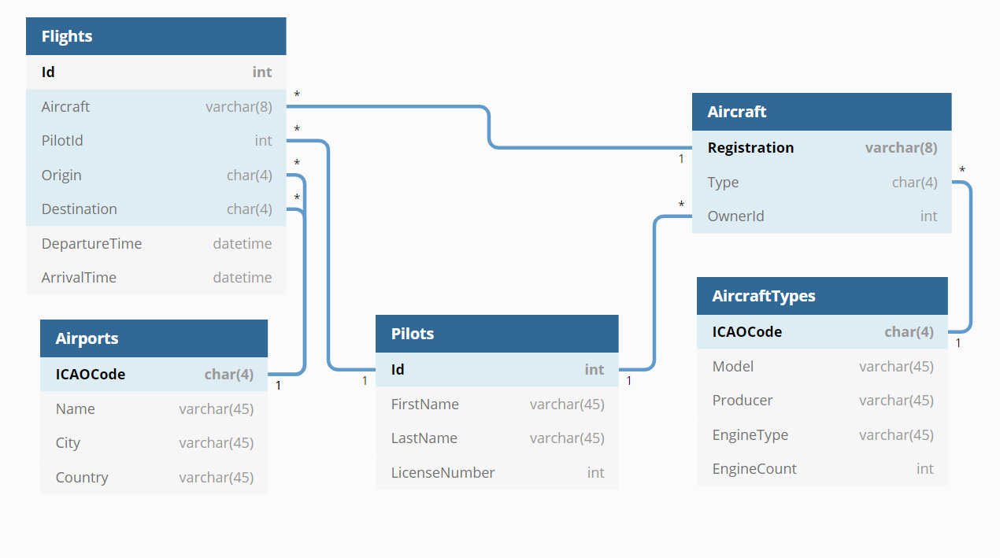

# AviationDb
Praca domowa 1 z Baz Danych - system zbierający dane o lotach w pewnym aeroklubie.

## Użycie
Program powinien budować się out-of-the-box, wymaga C# 9.0 oraz paczek `Microsoft.Data.SqlClient 2.1.2`
 i `Extended.Wpf.Toolkit 4.0.2`, był testowany na .NET 5.

## Struktura projektu
```text
Database/ - zawiera większość kodu wchodzącego w interakcję z bazą danych
db_create.sql - skrypt generujący bazę danych, wypełnioną przykładowymi informacjami
README.md - krótki opis projektu
```
*Większość pozostałych plików odpowiada za logikę GUI.*

## Schemat bazy danych


## Opis programu
Program posiada następujące funkcjonalności, posegregowane w odpowiednie menu:

* `Flights` - pozwala wyświetlić listę lotów, dodać lub usunąć loty
* `Aircraft` - pozwala wyświetlić listę samolotów, dodać, usunąć lub zmodyfikować samoloty
* `Pilots` - pozwala wyświetlić listę pilotów, dodać, usunąć lub zmodyfikować dane pilotów

Menu `Database` pozwala na połączenie/rozłączenie z bazą danych oraz zamknięcie programu.

Dostępne są również 2 podsumowania (`Summary`):

* `Pilots` - raport sumarycznego czasu lotów wykonanych przez poszczególnych pilotów
* `Aircraft` - raport sumarycznego czasu lotów wykonanych przez poszczególne samoloty